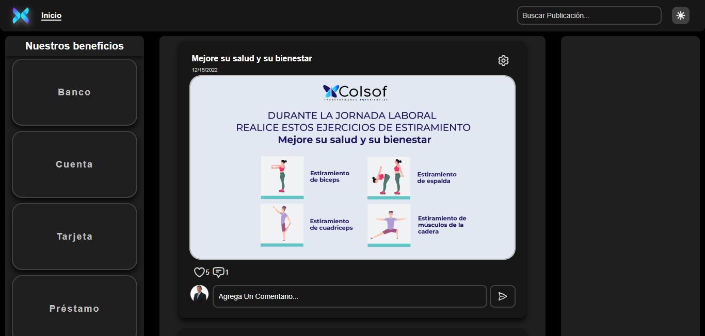
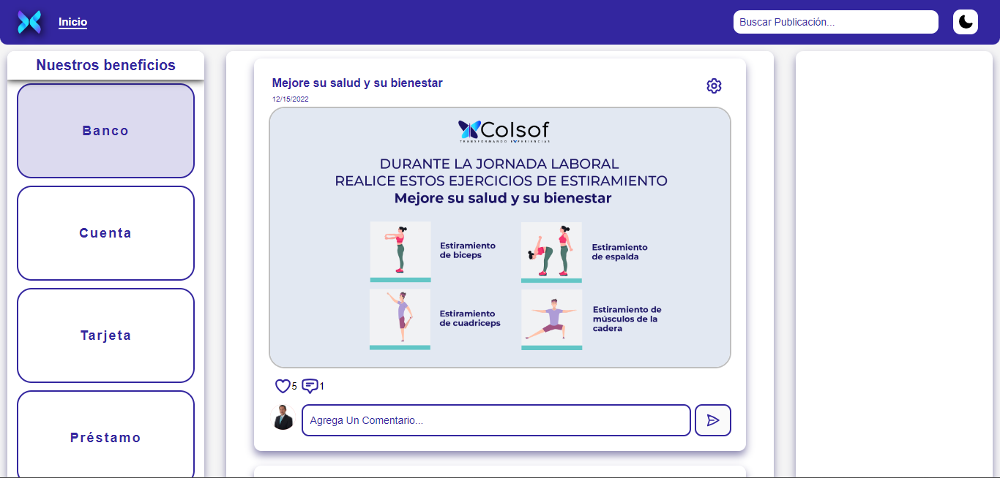

<details>
<summary><strong style="font-size: 20px;">Resultado</strong></summary>





</details>

## Pasos

```sh
# Clonar repositorio
git clone https://github.com/Jhonatan2022/BLOG-TEMPLATE.git
```

```sh
# Entrar a la carpeta del proyecto
cd Blog-RH/
```

```sh
# Instalar dependencias
npm i
```

```sh
# Iniciar servidor de desarrollo
npm run dev
```

```sh
# Abrir servidor
http://localhost:5173/
```

## Webs de utilidad

- [HeroIcons](https://heroicons.com/)
